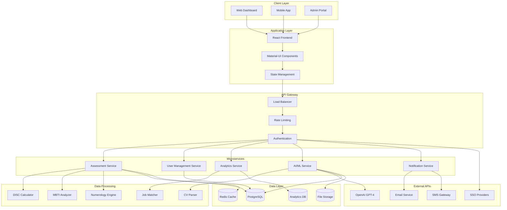
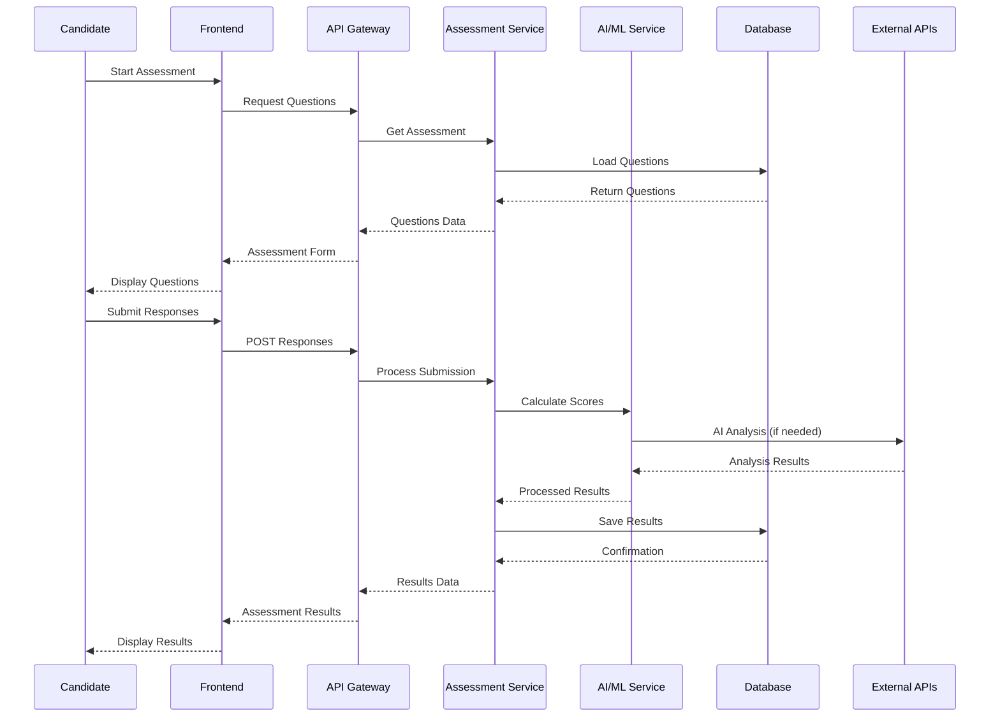
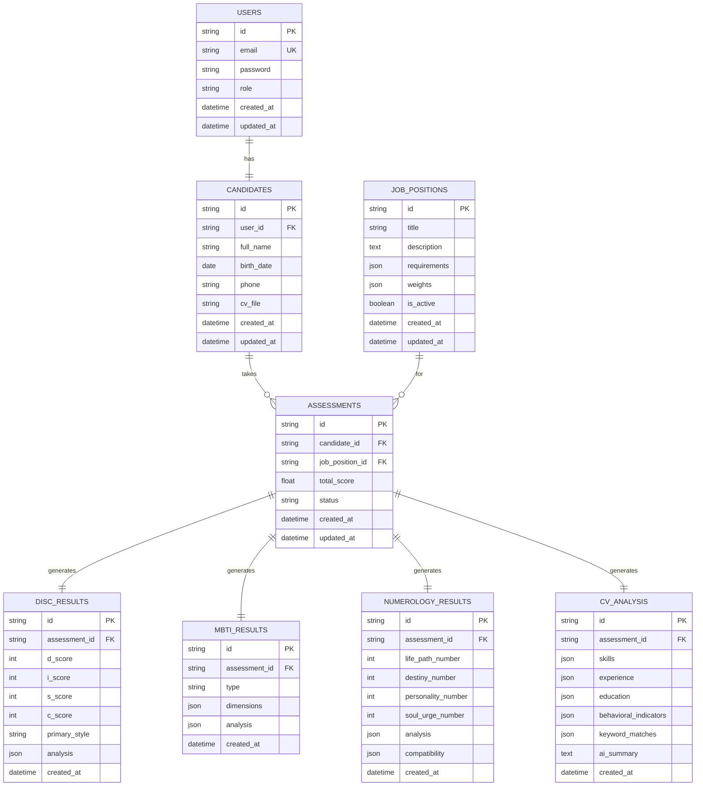

# Technical Architecture - HR Profiling Platform
**Framework**: SDLC 4.7 Compliant

# Technical Architecture Diagram
## HR Profiling & Assessment Platform

# Data Flow Diagram
## Assessment Process

# Database Schema Overview

